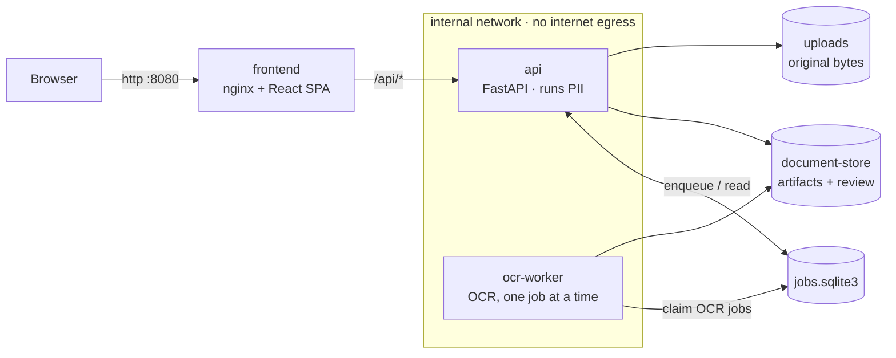

# Privacy De-Identification

## Windows Quick Start

Open PowerShell and run:

```powershell
irm https://raw.githubusercontent.com/rubennati/privacy-deidentification/main/scripts/windows/install.ps1 | iex
```

The following commands are then available:

```powershell
& "$HOME\PrivacyDeID\deid.ps1" start
& "$HOME\PrivacyDeID\deid.ps1" update
& "$HOME\PrivacyDeID\deid.ps1" stop
& "$HOME\PrivacyDeID\deid.ps1" status
```

The app runs at <http://localhost:8080>. The installer provisions the local OCR and GLiNER models
automatically, so the **first** setup downloads ~1.3 GB and takes a while; later starts are fast and
fully offline. Give Docker Desktop **≥ 4 GB RAM** (Settings → Resources) so the GLiNER model fits.
It also enables local script execution for your user (`RemoteSigned`, no admin needed) so the
commands above work. See [Windows Local App](docs/windows-local-app.md) for details, including the
Group-Policy fallback.

## Branch workflow

Feature and documentation PRs target `dev`, the integration branch. `main` is the curated,
user-stable local-app branch and receives only intentional promotions from `dev` or explicit
hotfixes. Windows installation and update scripts always use `main`.

A Docker-first application foundation for privacy-focused document preparation and de-identification workflows.

Users can upload documents through a web interface. The backend validates each upload, stores
only the original bytes under `./volumes/uploads`, and keeps metadata and processing artifacts
separately under `./volumes/document-store`. All host storage lives under a single `DATA_ROOT`
(default `./volumes`).

> **Scope:** This version provides upload/document management, structural Audit v1, worker-based
> OCR/Text, detection-only PII (default local GLiNER NER) projected precisely onto a clean reading
> text, and a manual review workflow — grouped per-entity decisions (pseudonymize / keep / false
> positive) plus manual add of missed entities, recorded in an immutable review result.
> Pseudonymization, redaction, and export remain separate later steps.

## Approach: tool-first / adapter-bound

Core OCR, NER, redaction, and pseudonymization intelligence comes from **proven open-source tools
behind adapters**. Extraction/OCR (for example OCRmyPDF, Tesseract, or MinerU), PII/PHI detection
(Presidio/noirdoc), and future redaction (PyMuPDF) remain replaceable behind ports. Narrow Presidio
recognizers, context rules, candidate validation, and deterministic domain heuristics are allowed
when documented, tested, benchmarkable, reviewable, and auditable. See [`AGENTS.md`](AGENTS.md).

## Engine capability model

The core of the project is the engine: local OCR/Text, local PII/sensitive-data, review/feedback,
and optional (later) local AI assist. [`docs/engine/`](docs/engine/README.md) defines what each
central engine should do on a **0–19 maturity scale**, the artifacts and metrics, the runtime
settings, the tool strategy, the target architecture (including the database and optional-local-AI
questions), and the roadmap. See [ADR-0011](docs/adr/0011-engine-capability-model.md) and
[ADR-0016](docs/adr/0016-engine-maturity-levels-0-19.md). Current standing (summary): OCR/Text
**L15**, PII **L14** (L10 partial), Review **L2 production / L10 done**, Benchmark **L10**,
Redaction **L0**.

## Architecture



<details><summary>Text diagram + storage layout</summary>

```text
Browser ──http://localhost:8080──▶ frontend (nginx)
                                     ├─ /       → React/Vite SPA
                                     └─ /api/*  → reverse proxy ─▶ api (FastAPI :8000)
                                                                    │ enqueue/read jobs
                                                                    ▼
                                                               jobs.sqlite3
                                                                    ▲
                                                                    │ claim OCR jobs
                                                               ocr-worker

Shared local storage (under DATA_ROOT, default ./volumes):
  ./volumes/uploads         byte-identical originals
  ./volumes/document-store  metadata, artifacts, review/feedback sidecars
  ./volumes/job-state       jobs.sqlite3 (durable job metadata)
  ./volumes/ocr-models      local PaddleOCR models, mounted read-only
```

</details>

* **frontend** — React 18 + Vite + TypeScript + Tailwind, served by nginx. The frontend is the only public entry point and proxies API calls to the API.
* **api** — Python 3.12 + FastAPI. Validates uploads, stores originals, enqueues OCR jobs, exposes safe job status, runs PII synchronously, and manages immutable result artifacts.
* **ocr-worker** — the isolated OCR process. It claims pending OCR jobs from SQLite and writes the same immutable `text_result` artifacts the API used to create in-process.
* **networking** — the API and OCR worker are not published to the host. They are reachable only inside the Docker Compose network.
* **runtime data** — a single host `DATA_ROOT` (default `./volumes`) is mapped onto stable internal container paths: `${DATA_ROOT}/uploads` → `/data/uploads` (originals only), `${DATA_ROOT}/document-store` → `/data/document-store` (metadata, artifacts, review/feedback sidecars), and `${DATA_ROOT}/job-state` → `/data/job-state` (the SQLite job DB `jobs.sqlite3`). The API and OCR worker share these exact mounts, so job state and artifacts never split. Nothing under `DATA_ROOT` is committed (see `.gitignore`).

See [`docs/adr/0001-stack-and-architecture.md`](docs/adr/0001-stack-and-architecture.md) for the stack decision and rationale.

## Status & roadmap

**Working today (fully local, offline):**

- Upload & document management; structural audit of the original.
- OCR/Text extraction with a clean, human-readable reading text.
- PII detection — local GLiNER for names/organisations plus deterministic patterns for structured
  identifiers (IBAN, e-mail, phone, UID, tax number, …) — with precise per-entity highlights.
- Manual review: per-entity decisions (pseudonymize / keep / not PII) and manual add of a missed
  entity, recorded in an immutable review result.

**Detection quality** (synthetic benchmark, indicative): ~90 % recall at ~85 % precision; structured
identifiers near 100 %. The design deliberately favours **recall** — catching PII matters most, and
an over-mark is corrected with one click in review.

**Next on the roadmap:**

- Pseudonymization / redaction and export (copy / PDF), replacing each value across all occurrences.
- Detection tuning toward 95 % (organisation & date recall; optional reference-list gazetteers as a
  soft, human-in-the-loop signal for the long tail).
- Optional: split PII into its own worker (like OCR) as the pipeline grows.

For the detailed capability model, metrics, and target architecture see
[`docs/engine/`](docs/engine/README.md).

## Requirements

* Docker Engine with the Compose plugin (`docker compose`)

No local Python or Node.js installation is required for normal development commands. Tooling runs in containers.

## Quick start

```bash
cp .env.example .env        # optional; defaults are built in
make models                 # once: OCR + GLiNER models (~1.3 GB backbone download)
make up                     # start frontend + api + ocr-worker → http://127.0.0.1:8080
```

### Commands (few, each maps 1:1 to `docker compose`)

| Command | What it does |
| --- | --- |
| `make up` | Run the stack (default GLiNER PII, 4g), production-local. **Does not build.** Run `make models` once first. |
| `make dev` | Same, plus the dev feedback + per-run engine-settings UI. Also no build. |
| `make update` | You changed code → rebuild only the **changed** layers and restart what changed. |
| `make rebuild` | Force a full **no-cache** rebuild, restart, then drop the old layers. |
| `make stop` | Stop the stack; containers kept, all data on disk. |
| `make down` | Stop **and remove** the containers; uploads/artifacts/models/job state remain. |
| `make prune` | Reclaim this project's build leftovers (dangling images + build cache; safe). |

`make help` lists everything. Start/stop never build, so the daily loop is fast; only `update` /
`rebuild` build.

Prefer plain Docker Compose (no `make`)? The targets map 1:1 — run `make runtime-dirs` once to
create the `./volumes` folders, then:

```bash
docker compose up -d                            # = make up
docker compose build && docker compose up -d    # = make update
```

### Update to the latest version

This works from **any** previous state (even weeks behind) and preserves your data:

```bash
git checkout main && git pull   # get the newest curated state
make models                     # only if new models are needed — safe/idempotent to re-run
make update                     # rebuild the changed layers and restart
```

`make update` rebuilds only what changed; if an update ever looks inconsistent, `make rebuild`
forces a clean full rebuild. Uploaded documents, artifacts, and job state under `./volumes` are
kept across updates. On **Windows**, run `& "$HOME\PrivacyDeID\deid.ps1" update` — it does the same.

### Developer vs production-local

- **`make up`** — production-local: the default **GLiNER** NER (best person/organization detection),
  a 4g API limit, dev-only settings **off**. Provision models once with `make models`. GLiNER runs
  fully offline (no runtime download); its mdeberta-v3-base backbone peaks ~3 GiB while loading, so
  keep `API_MEMORY_LIMIT` at its 4g default (only lower it together with `PII_NER_BACKEND=spacy` on a
  constrained host).
- **`make dev`** — same runtime plus developer conveniences via `docker-compose.dev.yml`
  (`ENABLE_DEV_ENGINE_SETTINGS=true`: review feedback + per-run engine settings).

### Runs fully local

| Service | Role | Egress |
| --- | --- | --- |
| `frontend` | nginx + React SPA; proxies `/api/*` | ingress network (serves the SPA; touches no documents/PII) |
| `api` | FastAPI scheduler/status/artifact reader; runs PII synchronously | **blocked** (internal network) |
| `ocr-worker` | isolated OCR execution, one job at a time | **blocked** (internal network) |

The `api` and `ocr-worker` — which do **all** document/OCR/PII/GLiNER processing — sit on an
`internal: true` Compose network with **no route to the internet** (verified: their egress is
blocked while the app stays reachable). The web port binds to `127.0.0.1` only; set `WEB_BIND=0.0.0.0`
to expose it on the LAN (e.g. a demo).

OCR worker mode is the default (`OCR_EXECUTION_MODE=worker`). `POST /api/documents/{id}/ocr`
enqueues a SQLite-backed job and returns `202` with safe job metadata; the frontend polls
`GET /api/jobs/{job_id}` and reads the finished artifact via `GET /api/documents/{id}/ocr`. Because
OCR runs in `ocr-worker` with its own memory ceiling, an OCR OOM/crash does not take down the API.
PII remains synchronous in the API.

The sync fallback remains available for development and targeted tests:

```bash
OCR_EXECUTION_MODE=sync make up
```

In sync mode, `POST /api/documents/{id}/ocr` returns the text artifact directly with `201`.

The old slim/pii/ocr/full Make targets and `INSTALL_OCR`/`INSTALL_PII` build toggles were removed.
The default backend image now includes the required OCR and PII dependencies; API and OCR worker use
that same image for Phase 3.6. Splitting a slimmer API image from the worker image is documented as
a future optimization, not current complexity.

#### Runtime job status in the UI

The document page shows the OCR job's lifecycle (accepted/queued, running, succeeded, failed) as it
happens, and recovers it after a page reload: the frontend tracks the job id returned by a `202`
response in `localStorage`, polls `GET /api/jobs/{job_id}` (falling back to
`GET /api/documents/{id}/jobs` if the id was not available locally), and refreshes the OCR/Text view
once the job succeeds. A failed job shows the backend's sanitized `error_message`, never a raw
exception or document text. Today this is **polling plus `localStorage`, no push transport** — no
Redis/RQ/Celery, no WebSocket/SSE/browser notifications. The frontend consumes job status only
(never worker internals), so a future push-based notification transport can replace polling without
changing what a job status response looks like. See
[ADR-0030](docs/adr/0030-runtime-job-ux-notifications-v1.md).

## API

| Method | Path                   | Description                                                |
| ------ | ---------------------- | ---------------------------------------------------------- |
| GET    | `/api/health/live`     | Liveness check                                             |
| GET    | `/api/health/ready`    | Readiness check for both persistent storage directories    |
| GET    | `/api/config`          | Effective upload limits, safe PII defaults, and dev gate   |
| POST   | `/api/uploads`         | Upload one document via `multipart/form-data` field `file` |
| GET    | `/api/documents`       | List uploaded documents, newest first                      |
| GET    | `/api/documents/{id}`  | Get one uploaded document                                  |
| DELETE | `/api/documents/{id}`  | Delete a document's file and metadata                      |
| POST   | `/api/documents/{id}/audit` | Create an immutable Audit v1 result (per-page text-quality) |
| GET    | `/api/documents/{id}/audit`  | Get the newest Audit v1 result                       |
| POST   | `/api/documents/{id}/ocr`   | Enqueue or create an immutable text result (mode-dependent) |
| GET    | `/api/documents/{id}/ocr`    | Get the newest text result                            |
| POST   | `/api/documents/{id}/pii`   | Detect and label PII in the newest text result         |
| GET    | `/api/documents/{id}/pii`    | Get the newest PII result                              |
| POST   | `/api/documents/{id}/pii/feedback` | Append gated dev-only entity feedback          |
| GET    | `/api/documents/{id}/pii/feedback`  | Restore gated dev-only feedback by artifact    |
| GET    | `/api/jobs/{job_id}`   | Safe status metadata for one OCR/PII job                    |
| GET    | `/api/documents/{id}/jobs` | Newest-first safe job metadata for one document (default limit 20, max 100) |

`POST /api/uploads` returns `201` with:

```json
{
  "id": "uuid",
  "filename": "document.pdf",
  "size": 12345,
  "status": "received",
  "sha256": "64-character lowercase hex digest",
  "detected_mime_type": "application/pdf",
  "original_artifact": {
    "id": "artifact uuid",
    "document_id": "uuid",
    "kind": "original",
    "storage_filename": "uuid.pdf",
    "sha256": "64-character lowercase hex digest",
    "mime_type": "application/pdf",
    "size_bytes": 12345,
    "created_at": "2026-06-30T18:00:00Z"
  }
}
```

Invalid uploads return clean JSON errors with a correlation ID:

* `400` for missing or empty uploads
* `413` for files exceeding the configured size limit
* `415` for unsupported file types

Stack traces are not exposed to clients.

### Storage layout

All host storage lives under a single `DATA_ROOT` (default `./volumes`); deployments set only
`DATA_ROOT`, and Compose maps its subdirectories onto stable internal container paths. New
documents use deliberately separate roots:

```text
${DATA_ROOT}/            # default ./volumes
├── uploads/
│   └── <document_id>.<validated_extension>
├── document-store/
│   └── <document_id>/
│       ├── document.json
│       ├── artifacts/
│       │   └── <artifact_id>.json
│       ├── feedback/
│       │   └── pii_feedback.jsonl
│       └── review/
│           └── pii_review_decisions.jsonl
├── job-state/
│   └── jobs.sqlite3
└── pii-feedback-archive/
    └── pii_feedback.jsonl
```

The internal paths (`UPLOAD_STORAGE_DIR` → `/data/uploads`, `DOCUMENT_DATA_DIR` →
`/data/document-store`, `DATA_JOB_STATE_DIR` → `/data/job-state`) are advanced overrides only and
are not part of `.env.example`. The upload root contains byte-identical originals only: storage
filenames are generated from a server-side UUID; the user-visible Unicode filename is retained only
in `document.json` and never used as a path. The document-store root contains one validated
UUID-named directory per document; Audit, OCR/Text, and PII results are all immutable JSON files in
that document's `artifacts/` directory. Deleting a document removes its UUID-named original and
exactly its own document-store directory — including `feedback/pii_feedback.jsonl`.

`PII_FEEDBACK_ARCHIVE_DIR` is a third, separate root: one shared, cross-document JSONL log that
every recorded feedback entry is *also* appended to, unchanged (`document_id` retained). Unlike
the per-document copy, it is never touched by document deletion — by design, so review feedback
can outlive its source document and later feed PII-quality improvement or the private benchmark
(see [review-feedback-levels.md, Level 14](docs/engine/review-feedback-levels.md#level-14--feedback-to-regression-workflow--open)).

Both feedback copies are a local, dev-gated analysis side-channel, not an immutable engine artifact
or a binding review result. Their structured fingerprint excludes raw document/entity text, but
optional comments can still contain sensitive input; treat both as protected data and never commit
them.

ADR-0023 also keeps durable job metadata in SQLite, in its own dedicated `job-state` root so the DB
never sits next to per-document artifact folders. By default `JOB_STORE_DB_PATH` is empty and the
API resolves it to `${DATA_JOB_STATE_DIR}/jobs.sqlite3`; in Docker/Compose that is
`/data/job-state/jobs.sqlite3`, bind-mounted from `${DATA_ROOT}/job-state/jobs.sqlite3`. The API and
`ocr-worker` use the same environment and volume mounts, so API-created pending jobs, worker status
updates, worker-produced artifact references, and status reads all meet at the same file. If
`JOB_STORE_DB_PATH` is overridden, it must still point at a path mounted into both services. For
backup/restore, treat everything under `DATA_ROOT` as one unit and stop the stack before copying
SQLite files, including any `jobs.sqlite3-wal` and `jobs.sqlite3-shm` sidecars.

#### Existing local development data

There is no automatic migration and startup never moves or deletes existing files. If you have data
from a previous layout under `./volumes/document-data` (including a `jobs.sqlite3` there), move
`./volumes/document-data` to `./volumes/document-store` and relocate `jobs.sqlite3` (with any
`-wal`/`-shm` sidecars) into `./volumes/job-state/` while the stack is stopped; back up `volumes/`
first. Data created by much older versions (`<id>.meta.json` and `artifacts/<id>/` below
`volumes/uploads`) is intentionally not discovered by the current layout — re-upload those documents
if they are still needed. Old files remain untouched until a developer removes them explicitly.

### Text-layer quality gate and page-level OCR fallback

`has_text_layer` alone is not enough. Some PDFs ship a formally present but **broken/encoded**
text layer: many characters, almost no letters, mostly digits/symbols/control characters.
Extracting that layer yields garbage that pollutes PII detection, while OCR of the same page
produces usable text. Audit therefore assesses each PDF page's *character/token plausibility* with
a dependency-free heuristic (no ML, no dictionary; see
[`text_quality.py`](backend/app/services/text_quality.py)) and records the verdict additively on
the page — only aggregate metrics, **never the page text**:

```json
{
  "page_number": 1,
  "has_text_layer": true,
  "text_char_count": 6183,
  "text_quality_status": "BROKEN_TEXT_LAYER",
  "text_quality_score": 0,
  "text_quality_reasons": ["very_low_letter_ratio", "high_symbol_or_digit_ratio", "few_word_tokens"],
  "recommended_text_source": "ocr",
  "needs_ocr": true
}
```

| Status | Meaning | OCR/Text routing |
| ------ | ------- | ---------------- |
| `GOOD_TEXT_LAYER` | Enough text, plausible characters/tokens | Use text layer |
| `LOW_CONFIDENCE_TEXT_LAYER` | Sparse or mixed signals (e.g. a short line, or a partly-usable scan page) | Use text layer (conservative) |
| `BROKEN_TEXT_LAYER` | Enough characters, but clearly implausible | **OCR** |
| `EMPTY_TEXT_LAYER` | No meaningful text (blank or scanned page) | **OCR** |

A high digit ratio alone never means "broken": tables and invoices are number-heavy. The decisive
signal is the near-total absence of **real words** — broken pages extract as digit/symbol tokens
with `letter_ratio ≈ 0` and no word tokens, while even the most number-heavy legitimate page keeps
its label words (`letter_ratio ≥ 0.64` on the local corpus). A hard fail therefore requires a
symbol/digit-dominated page together with almost no letters (or essentially no real words).
Thresholds are deliberately conservative and covered by unit tests
([`test_text_quality.py`](backend/tests/test_text_quality.py)).

Consequences:

- OCR/Text decides **per page**. A clean text-layer PDF never renders a page or initializes
  PaddleOCR; a mixed PDF OCRs only the empty/broken pages.
- A broken text layer is **never silently used** as the result. If a page needs OCR and the OCR
  runtime/models are missing, the request fails cleanly with `503` (the existing behavior) instead
  of falling back to garbage.
- Audit artifacts written before this gate carry no `needs_ocr`; routing then falls back to the
  original rule (OCR only pages without any text layer).

### OCR runtime and models

PDF text layers and DOCX text are extracted without PaddleOCR. DOCX extraction is table-aware: a
shared helper walks the document body in order and captures paragraphs, table cells (rows
newline-separated, cells tab-separated), and defined section headers/footers, so table content is
no longer dropped. Audit and OCR/Text use the same helper and therefore report the same DOCX
character count. Image documents and PDF pages without a text layer require PaddleOCR/PaddlePaddle
**plus** locally provisioned models. The default runtime image includes those packages, but
imports and model initialization are lazy, so startup and all quality gates remain model-free.
Requests return `503` only when a document actually needs OCR and models/runtime are unavailable.
Poppler is installed
for the encapsulated `pdf2image` PDF-page renderer; rendered pages use the container's `/tmp`
tmpfs and are never written to the persistent upload volume.

#### 1. Provision the models (once)

```bash
make ocr-models
```

This idempotent script downloads the default models from the official Hugging Face
`PaddlePaddle/*` repositories into `./volumes/ocr-models`, in the layout the adapter expects:

```text
volumes/ocr-models/
├── text_detection/     # PP-OCRv5_mobile_det
└── text_recognition/   # latin_PP-OCRv5_mobile_rec
```

**Model choice.** The default is the CPU-friendly **mobile** PP-OCRv5 pair (~13 MB total):
`PP-OCRv5_mobile_det` for detection and `latin_PP-OCRv5_mobile_rec` for recognition. The Latin
recognizer covers German and other Latin-script European languages, including umlauts and `ß`,
which the default (Chinese/English) recognizer does not. The heavier `*_server_*` variants offer
higher accuracy at a much larger CPU/memory cost and are a documented future option, not the
default. Override the models via `OCR_DET_MODEL` / `OCR_REC_MODEL` for the script and the matching
`OCR_DETECTION_MODEL_NAME` / `OCR_RECOGNITION_MODEL_NAME` for the backend. The models are never
committed (`.gitignore: /volumes/*`) and never downloaded at request time.

#### 2. Build and run the default stack

```bash
make up
```

Compose mounts the models read-only at `/models/ocr` and sets `OCR_MODEL_DIR=/models/ocr`. The
adapter passes both directories **and** the model names to PaddleOCR (PaddleOCR 3.x rejects a
non-default local model without its name) and returns `503` before importing PaddleOCR if the
directories are missing. It never falls back to downloading models.

#### 3. Smoke-test the runtime

```bash
make ocr-smoke     # builds the OCR image, renders a synthetic image, asserts text is recognized
make pii-smoke     # equivalent for the PII runtime
```

The smoke tests are deliberately separate from `make test`: they need the heavy runtime, and
`ocr-smoke` also needs the provisioned models. They fail with a clear message when models or
packages are missing.

#### Notes and caveats

- **CPU inference.** MKL-DNN (oneDNN) is disabled in the adapter: PaddlePaddle 3.x enables it by
  default for CPU, but its oneDNN path crashes on the PP-OCRv5 models
  (`ConvertPirAttribute2RuntimeAttribute not support`). Disabling it trades a little speed for a
  stable CPU path.
- **Speed.** CPU OCR of a multi-page scan can take a few minutes. Default worker mode returns `202`
  quickly and the frontend polls job status while the worker runs.
- **Memory isolation.** PaddleOCR runs in `ocr-worker` by default with
  `OCR_WORKER_MEMORY_LIMIT=2g`, so an OCR OOM/crash does not take down the API. If you explicitly
  use `OCR_EXECUTION_MODE=sync`, set `API_MEMORY_LIMIT=2g` for scanned/image OCR.
- **Apple Silicon / ARM.** PaddlePaddle's published wheels determine which CPU architectures can
  build the OCR image. It builds and runs natively on `linux/amd64`; on ARM hosts (Apple Silicon)
  an `amd64` build/emulation may be required and has not been verified here.
- **buildx warning.** `docker compose build` may print a legacy-builder warning; it is benign.
  Set `DOCKER_BUILDKIT=1` to silence it.

### PII runtime

PII Workstation v1 uses Microsoft Presidio Analyzer and spaCy behind a lazy adapter. The default
runtime image includes Presidio, spaCy, and the pinned German `de_core_news_sm` model wheel, so the
model is installed reproducibly during image build. Requests never download a model. Missing
packages, an unavailable model, or a language/model mismatch returns `503`; normal tests replace the
adapter and load no model.

PII coverage is selected with `PII_PROFILE`:

| Profile | Coverage |
| --- | --- |
| `structured-only` | EMAIL, PHONE, IBAN, CREDIT_CARD, IP, URL — precision-first default |
| `insurance-at-de` | structured + AT/DE and insurance/legal/business identifiers |
| `broad-review` | insurance-at-de + PERSON, ORGANIZATION, LOCATION |
| `review-heavy` | broad-review + DATE_TIME |

The `insurance-at-de` pack adds `UID_AT`, `FN_AT`, `SVNR_AT`, `TAX_ID_AT`, `BIC`,
`LICENSE_PLATE_AT`, `PASSPORT_NUMBER`, `ID_CARD_NUMBER`, `POLICY_NUMBER`, `CLAIM_NUMBER`,
`CONTRACT_NUMBER`, `CASE_NUMBER`, `FILE_REFERENCE`, `REPORT_NUMBER`, `ASSESSMENT_NUMBER`,
`INVOICE_NUMBER`, `OFFER_NUMBER`, `CUSTOMER_NUMBER`, `PROJECT_ID`, `TRANSACTION_ID`, and `USER_ID`.
The last group includes sensitive document metadata, not only classical PII. Generic domain values
require an adjacent label; strong, type-specific formats can match directly. Presidio's existing
types are reused for AT/DE phone, IBAN, credit card, and URL improvements.

`structured-only` is the conservative **code fallback** if `PII_PROFILE` is left completely unset
(see `backend/app/config.py`, `docker-compose.yml`); it is intentionally narrow — high precision,
low coverage. [`.env.example`](.env.example) instead sets the **recommended local review default**,
`PII_PROFILE=review-heavy`, for broadest coverage when a human reviews the results. Use
`insurance-at-de` for fewer false positives. The spaCy NER types remain **opt-in** (via
`broad-review`/`review-heavy`) because the small German model over-tags them at a fixed score that
the score threshold cannot filter.
`PII_ENTITY_TYPES` remains a backwards-compatible explicit allowlist override — set, it replaces
`PII_PROFILE` entirely and is recorded as profile `custom`; unset **or empty**, it has no effect
and the selected profile applies. The score threshold stays `0.5`. The `presidio-analyzer` logger
is capped at WARNING so its initialization messages do not flood logs, while genuine warnings
still surface.

After detection, **candidate validation** (PII L6) inspects every already-detected candidate and
keeps, downgrades, or drops it — a subtractive post-processing filter, never a new recognizer. Full
lexical/context rules run on `PERSON`/`ORGANIZATION`/`LOCATION`/`DATE_TIME` (the dominant NER
false-positive source); a lighter context-presence check runs on `BIC` and a handful of domain
identifiers; every other type is an intentional pass-through. A dropped candidate never appears in
`pii_result.entities`; a downgraded candidate's score is capped at `0.3` (below the default `0.5`
threshold, so it is excluded from the final list unless the threshold is deliberately lowered).
`pii_result` additively records, per surviving entity, `original_score`/`validation_status`/
`validation_reasons`, plus a document-level `validation` summary (`kept`/`dropped`/`score_down` and
reason-code counts — never a candidate's text). Set `PII_CANDIDATE_VALIDATION_ENABLED=false` to
fall back to raw detection output. See
[ADR-0013](docs/adr/0013-pii-candidate-validation.md) for the full rule set and rationale.

The runtime can be smoke-tested separately from the standard quality gates:

```bash
make pii-smoke
```

PII v1 only detects and labels spans in the persisted text artifact. It does not anonymize,
mask, redact, or alter source documents. Detected entity text is stored in a cleartext JSON
artifact under the same protected document artifact directory and is not written to logs.

## Manual document review

Open a document from `/documents` to use the detail page at `/documents/{id}`. Audit, OCR/Text,
and PII are started explicitly and never trigger the next station automatically. The page keeps
artifact lineage visible, marks stale downstream results, and only overlays PII whose input text
artifact matches the displayed text. PII highlighting uses Unicode codepoint offsets and renders
plain React text nodes—no HTML injection or source-text logging.

The default User View shows the **Kanonischer Lesetext** (clean, human-readable reading text) with
precise per-entity highlights; a **Technischer Rohtext** view shows the raw OCR text. PII is detected
on the byte-stable raw text — so every occurrence is caught for later redaction — and projected onto
the reading text with exact per-entity offsets: a reading-view highlight is either exactly right or
shown only in the technical view (never a whole paragraph).

With `ENABLE_DEV_ENGINE_SETTINGS=true`, the detail page also exposes one-run PII profile selection
and per-entity feedback. Feedback is restored from the local side-channel described above; it does
not alter `pii_result`, train a model, or create the future binding `review_result` artifact.

## Private OCR/PII benchmark

`scripts/benchmark/` is a local-only, standard-library-only tool that measures OCR/text-layer
routing and PII precision/recall/F1 against a private local document corpus and a private
candidate PII ground truth, without generating or committing any of that data:

```bash
make benchmark-private          # markdown + JSON + CSV report under volumes/benchmark/reports/
make benchmark-private-json     # JSON only
```

It only **reads** existing `document.json`/`audit_result`/`text_result`/`pii_result` artifacts
under `volumes/document-store/` — it never triggers audit/OCR/PII processing, calls the API, or
modifies/deletes a document. Missing artifacts are reported as `missing`, not generated. The
private benchmark inputs (`volumes/benchmark/ocr_pii_benchmark_*.json`) and every generated
report live under `volumes/`, which is entirely git-ignored (`/volumes/*`) — real documents,
their metadata, and any extracted PII never reach the repository. A privacy guard
(`scripts/benchmark/privacy_guard.py`) blocks report generation if a forbidden field name or a
PII-shaped string is ever about to be written. See [`scripts/benchmark/README.md`](scripts/benchmark/README.md)
for the full matching/metrics design and `make benchmark-test` for its synthetic-data test suite.

## Configuration

Configuration is handled through environment variables.

See [`.env.example`](.env.example) for the intentionally small runtime surface:

* `COMPOSE_PROJECT_NAME`, `TZ`, and `WEB_PORT`
* upload size and allowed extensions
* `DATA_ROOT` — the single host storage root (uploads, document-store, job-state, feedback archive,
  OCR models are subdirectories); container-internal paths are advanced overrides only
* `OCR_EXECUTION_MODE` (`worker` by default, `sync` fallback)
* API and OCR worker memory/polling limits
* OCR model names
* PII language/model/profile, score threshold, candidate validation, and dev gate

For normal local review, use the defaults: `PII_PROFILE=review-heavy`,
`PII_CANDIDATE_VALIDATION_ENABLED=true`, and `OCR_EXECUTION_MODE=worker`.

**PII profile quick guide:**

* `review-heavy` — default for local human review, broadest coverage
* `broad-review` — broad NER without DATE_TIME
* `insurance-at-de` — structured + AT/DE/domain IDs, fewer false positives
* `structured-only` — minimal smoke-test profile

If too little is detected, use `review-heavy` and rerun PII.
If too much is detected, use `insurance-at-de`.

Leave `PII_ENTITY_TYPES` commented out unless you intentionally want a custom allowlist instead of
a named profile.

**Common debugging steps:** after any `.env` change, recreate the containers (`make up`) and re-run
the affected station for the document you're checking — existing artifacts are immutable and never
reflect a config change retroactively. If PII detection looks empty, make sure `PII_PROFILE` is a
named profile, `PII_ENTITY_TYPES` is commented out, and candidate validation is enabled.

## Development and quality

Common commands are available through the `Makefile`:

```bash
make lint        # Ruff and ESLint
make typecheck   # mypy and TypeScript
make test        # runtime surface checks, backend tests, and frontend tests
make up          # start the stack (production-local, no build)
make dev         # start in developer mode (no build)
make update      # apply code changes: rebuild changed layers, restart
make rebuild     # force a full no-cache rebuild
make stop        # stop the stack (containers kept)
make down        # stop and remove the containers
make prune       # reclaim build leftovers (safe)
make logs        # tail Compose logs
make ps          # show Compose service status
make shell-api   # open a shell in the API image
make ocr-smoke   # smoke-test real OCR runtime (needs make ocr-models)
make pii-smoke   # smoke-test real PII runtime
make benchmark-private   # private local OCR/PII benchmark report (see above)
make benchmark-test      # synthetic-data unit tests for the benchmark runner
```

`make docker-df` shows Docker disk usage; `make prune` reclaims **this project's** build leftovers
(dangling images + build cache — safe, never touches `./volumes/` data or other projects). A deep
cross-project clean is a deliberate `docker system prune -af` (removes every unused image, including
other projects'; re-pullable) — never `--volumes` (that would delete your uploads/artifacts/models).

### Known local build issue (Colima)

On Colima's containerd storage, a full image build can intermittently fail while committing the large
dependency layer (`failed to export layer … rename … no such file`). It is transient, so `make
update` / `make rebuild` **retry the build up to 3×**. If it still fails, run it again or restart the
Docker VM (`colima restart`). Day-to-day `make up` / `make dev` don't build, so they are unaffected.

## Repository structure

```text
.
├─ .ai/                  # AI collaboration workspace
├─ backend/              # FastAPI backend
├─ frontend/             # React/Vite frontend served by nginx
├─ scripts/benchmark/    # Private local OCR/PII benchmark runner (see scripts/benchmark/README.md)
├─ docs/adr/             # Architecture decision records
├─ docker-compose.yml
├─ Makefile
├─ AGENTS.md             # Source of truth for AI-assisted development
└─ CLAUDE.md             # Pointer to AGENTS.md and .ai/
```

## Project conventions

This repository adopts the AI-collaboration parts of [`ai-project-standard`](https://github.com/rubennati/ai-project-standard):

* `.ai/` workspace for project state, decisions and task tracking
* `AGENTS.md` as the source of truth for AI-assisted development
* `CLAUDE.md` as a thin pointer to the project rules
* shared quality commands through the `Makefile`

See [`AGENTS.md`](AGENTS.md) for workflow, approval and quality rules.
